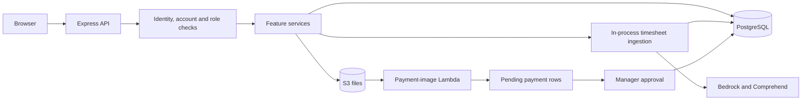

# DS2 architecture

Source review: 2026-09-24. This describes the checked-out code, not a verified deployment. Start with the [document and endpoint index](README.md). Detailed monetary rules belong to [ledger conventions](ledger/ledger-conventions.md); confirmed source defects belong to [findings](_review/findings.md).

## System boundaries

DS2 connects customer and job management, staff time, billing review, rolling invoice statements, payments and receivables. DS2_Frontend is the browser application. DS2_Backend exposes Express routes and uses Knex/PostgreSQL for records. S3 holds uploaded and generated files. The payment-image processor in DS2_Lambdas is a separate program. Backend timesheet ingestion uses Bedrock and Comprehend; it does not invoke that payment Lambda. Sources: `src/app.js:120`, `src/endpoints/timesheets/auto-ingest-orchestrator.js:541`, `../DS2_Lambdas/Process_Payment_Images/process_payments.py:21`.

The S3-to-Lambda arrow represents the checked-in event configuration. This review did not inspect deployed notifications or run either pipeline. The backend accepts payment uploads only for account 1; the Lambda uses its configured DB account. Sources: `src/endpoints/pendingPayments/pendingPayments-router.js:274`, `../DS2_Lambdas/Process_Payment_Images/terraform/prod/main.tf:248`, `../DS2_Lambdas/Process_Payment_Images/database.py:19`.

## Request flow

1. **Parse and limit.** Express trusts one proxy hop, parses cookies, applies Helmet and credentialed CORS, and parses JSON with a 1 MB limit. The general limiter is 300 requests per minute per IP. Authentication also has 30 requests per 15 minutes. Expensive AI requests and billing-review/audit mutations have a 30-per-minute limiter; those review/audit GET and HEAD requests bypass that extra limiter. The general limiter is disabled in tests or by DISABLE_RATE_LIMIT. Sources: `src/app.js:49`, `src/app.js:70`, `src/app.js:94`, `src/app.js:100`, `src/app.js:159`.
2. **Establish identity.** Google login verifies the configured audience, Workspace domain and verified email. It then requires an active, provisioned user with that exact stored email. The backend issues an HS256 JWT whose subject is the email and records the login. It does not return the JWT in the JSON body. Sources: `src/endpoints/auth/auth-service.js:8`, `src/endpoints/auth/auth-service.js:26`, `src/endpoints/auth/auth-service.js:38`, `src/endpoints/auth/auth-router.js:60`.
3. **Send the session cookie.** `ds2_auth` is HttpOnly, SameSite=Strict and path=/; Secure is enabled in production. Cookie lifetime parses the configured duration separately from JWT signing, with an 11-hour fallback. Protected requests prefer this cookie over a Bearer token. JWT verification is followed by a fresh active-user lookup, which supplies the trusted user, account and access level. That lookup does not check whether the account itself is active. Sources: `src/endpoints/auth/auth-cookie.js:6`, `src/endpoints/auth/auth-cookie.js:10`, `src/endpoints/auth/auth-cookie.js:23`, `src/endpoints/auth/jwt-auth.js:7`, `src/endpoints/auth/jwt-auth.js:18`.
4. **Scope the account.** Registered accountID parameter guards require an integer equal to the authenticated account. Super Admin does not bypass this comparison. Routes without an account parameter use the authenticated account where their contract specifies it. A userID segment is not universally the actor or owner: tracker history, notifications and user reads install self-or-privileged checks; timesheets apply that check to queryUserID. Sources: `src/endpoints/auth/account-scope.js:7`, `src/endpoints/auth/account-scope.js:28`, `src/endpoints/timeTracking/timeTracking-router.js:33`, `src/endpoints/timesheets/timesheets-router.js:11`.
5. **Apply the role gate and feature rules.** Financial/work routes generally admit Manager, Admin, Super Admin and legacy Owner. Account settings require Admin or Super Admin. User mutations, analytics and account audits require Super Admin. Role comparisons lowercase the stored value. A role check does not prove that every submitted related ID belongs to that account. F1–F3 are fixed: response reads use the verified account, submitted work references are account-validated and joined labels are scoped, and ordinary staff receive an empty bootstrap shell plus their own ID/name. See the [remediation tests](_review/findings.md#f1). Sources: `src/endpoints/auth/jwt-auth.js:64`, `src/endpoints/auth/jwt-auth.js:94`, `src/app.js:122`, `src/app.js:170`.

The [endpoint index](README.md#endpoint-index) gives the actual gate for each route. It also includes public health/login/logout and the authenticated, retired AI catch-all. The frontend manager gate includes legacy Owner, matching the backend ([F37](_review/findings.md#f37)).

### Error envelopes

| Layer or route family | What callers must inspect |
|---|---|
| Authentication/account/role middleware | Real HTTP 401 or 403 with a JSON message; some include status. |
| Parsers and rate limiters | HTTP 400 for malformed JSON, 413 for parser limits, 429 for rate limits. A feature can impose a smaller upload limit. |
| Legacy ledger/customer/invoice handlers | Many return HTTP 200 with body status 404 or 500. A successful transport is not sufficient. |
| Newer review, timesheet, audit and file handlers | Usually real HTTP error codes; precise envelopes differ by endpoint. Cascade success has no numeric status field. |
| Final Express error handler | Uses err.status or 500; masks the message as Server error in production. Nonproduction responses also include the error object. |

There is no universal response envelope. Consult the owning contract before treating a request as successful or retryable. Finalization returns committed success with invoice identities and warnings if its later combined export or list refresh fails ([F15](_review/findings.md#f15), fixed). Sources: `src/app.js:178`, `src/endpoints/payments/payments-router.js:26`, `src/endpoints/billingReview/billingReview-router.js:311`, `src/endpoints/invoice/invoice-router.js:389`.

## Data model at a glance

| Records | Main relationships and purpose | Detail |
|---|---|---|
| accounts, account_information, users, user_login_log | Account identity/address, immutable storage_slug, account users and login history. | [Accounts and auth](platform/accounts-users-auth.md) |
| customers, customer_information, recurring_customers | Account customers, contact/address rows and recurring billing settings. Recurring flags and subscription rows are separate state. | [Customers](work/customers.md) |
| customer_job_categories, customer_job_types, customer_jobs | Category → type → customer job. Jobs have parent_job_id version families; a transaction can remain on an older version. | [Job catalogs](work/job-categories-and-types.md), [jobs](work/jobs.md) |
| customer_general_work_descriptions, customer_quotes | Reusable descriptions and separate quote records with customer/job references. Quotes are not issued invoices. | [Descriptions](work/work-descriptions.md), [quotes](work/quotes.md) |
| timesheet_entries, ai_time_tracker_transaction_suggestions | Imported holding rows and suggested customer/job/category assignments, before or alongside review. | [Timesheets and ingestion](platform/timesheets-and-ingestion.md) |
| ai_category_training_examples, ai_reviewer_corrections, ai_call_log | Per-account examples, reviewer decisions and model-call cost/log metadata. | [Billing review](invoicing/billing-review.md), [ingestion](platform/timesheets-and-ingestion.md) |
| customer_transactions | Work linked to account/customer/job, logged-for user and optional description, retainer and invoice. | [Transactions](work/transactions.md) |
| customer_invoices | Issued parent statements and child balance snapshots; includes dates, totals and stored artifact key. | [Invoices](invoicing/invoices.md) |
| customer_payments, customer_writeoffs, customer_retainers_and_prepayments | Posted financial events and retainer history linked to customers and, where relevant, jobs/invoice snapshots. | [Ledger conventions](ledger/ledger-conventions.md) |
| customer_payments_processed | Extracted payment candidates, source names and review/processed/deleted flags. Approval creates a posted payment separately. | [Pending payments](ledger/pending-payments.md) |
| account_audits, customer_rate_agreements | Saved audit evidence and separate customer/year analytics agreements. Neither is an invoice parent. | [Audits](invoicing/account-audit.md), [analytics](invoicing/analytics.md) |
| tracker_file_owners, template_downloads | Exact legacy tracker-key ownership and template download records. Numeric account/user paths identify new tracker originals. | [Time tracking](platform/time-tracking.md) |
| notifications, time_tracker_staff, account_automation_settings, account_automation_recipients | User notifications, tracker recipient membership and scheduled-email settings. Membership does not grant billing access. | [Notifications](work/initial-data-and-notifications.md), [operations](platform/operations.md) |

These are logical relationships, not a claim that every link has a database foreign key. Several tables lack customer FKs; other FKs validate an ID without enforcing matching account IDs. The source findings document the resulting gaps. Reference definitions: `migrations/schema-snapshot-2026-09-22.sql:190`, `migrations/schema-snapshot-2026-09-22.sql:404`, `migrations/schema-snapshot-2026-09-22.sql:441`, `migrations/schema-snapshot-2026-09-22.sql:545`, `migrations/schema-snapshot-2026-09-22.sql:758`, `migrations/021.tracker_file_owners.sql:1`.

The snapshot and numbered migrations must be read together. They are not evidence of the live schema. Migration 005 removes suggestion columns still referenced at runtime; additive migration 022 restores them explicitly ([F30](_review/findings.md#f30)). See [operations](platform/operations.md#schema-sources-and-migration-inventory) for the baseline and migration rules.

## Ledger conventions and edit boundaries

[Ledger conventions](ledger/ledger-conventions.md) is the shared reference for signs, rounding, invoice and retainer chains, statement membership, markers and locks. Do not sum parent and child snapshots as independent debts, or subtract displayed unused retainer credit again. Feature guides explain the operations that use those conventions.

| Operation | Boundary |
|---|---|
| Direct work update/delete | Refuses invoice-linked work. See [transactions](work/transactions.md#7-create-edit-and-delete). |
| Billing-review correction | Can adjust billed work under explicit date, balance, customer and retainer restrictions; does not regenerate an issued PDF. See [billing review](invoicing/billing-review.md#7-create-edit-and-delete). |
| Retainer update | Changes the owned chain under its own rules; it does not inherit the direct-work billed guard. See [retainers](ledger/retainers-and-prepayments.md#7-create-edit-delete-and-draws). |
| Payment, NSF and write-off | Uses financial-event and invoice-chain guards. A reversal records a new event. See [payments](ledger/payments.md) and [write-offs](ledger/write-offs-and-adjustments.md). |

Customer ledger locks serialize core financial writers. Customer deletion now holds that same lock across raw history checks and contact/customer deletion ([F25](_review/findings.md#f25)). Pending-payment deletion now conditions its write on unprocessed/nondeleted state, so a concurrent approval wins without being hidden ([F16](_review/findings.md#f16), fixed).

## Background processes

| Process | Trigger, work and persistence boundary |
|---|---|
| Tracker import | HTTP upload validates the workbook and owner, detects duplicate rows, and stores a gzip original plus holding rows and ownership evidence. A per-owner advisory lock protects duplicate detection. S3 cleanup on failure is best effort. See [time tracking](platform/time-tracking.md#7-create-edit-delete-and-side-effects). |
| Timesheet AI ingestion | Enabled for on, or test with an allowed account. setImmediate starts work inside the API process, with bounded parallelism. Matching/model decisions either hold a row or conditionally claim it and call the shared transaction writer. This is not a durable job queue. See [ingestion](platform/timesheets-and-ingestion.md#7-create-edit-delete-and-side-effects). |
| Payment-image Lambda | Handles the first S3 event record, reads OCR/CSV/text, redacts numeric PII, matches customers and inserts pending rows. It then archives the source and may delete the pending object. It does not itself post customer_payments. The extracted batch commits atomically before archival; archive upload and HEAD length verification precede pending deletion. Failures propagate for retry (fixed [F5](_review/findings.md#f5) and [F6](_review/findings.md#f6)). See [pending payments](ledger/pending-payments.md). |
| Account-audit batch | API starts an in-process job. Each customer gets one repeatable-read, read-only ledger/engine snapshot. Saved audits, optional model narrative and best-effort S3 PDFs follow. Poll state lives in a process-local Map and expires after two hours; audit records persist. See [account audit](invoicing/account-audit.md#7-create-edit-and-delete). |
| Reminder schedules | Every non-test API process schedules Thursday 09:00, Friday 15:30 and daily 09:00 jobs in America/Phoenix. The daily job checks missing prior-week trackers. There is no distributed scheduler lock or durable send log. The weekly AI-training setting has no scheduled upload job. See [operations](platform/operations.md#6-scheduling-and-calculations). |

Sources: `src/endpoints/timesheets/auto-ingest-runner.js:55`, `src/endpoints/timesheets/auto-ingest-orchestrator.js:712`, `src/endpoints/accountAudit/account-audit-router.js:133`, `src/automations/automationOrchestrator.js:10`, `src/app.js:173`.

## Storage layout

The S3 client uses S3_BUCKET_NAME, S3_REGION and S3_ENDPOINT; explicit credentials are used only when both configured values exist, otherwise it uses the AWS credential chain. Code does not establish deployed encryption, versioning, lifecycle or retention. Source: `src/utils/s3.js:1`.

| Object family | Key layout and authority |
|---|---|
| Logos | `{storage_slug}/app/assets/...`; saved account key or own default logo. |
| Invoice ZIPs | `{storage_slug}/invoicing/{subarea}/{timestamp}_{runUUID}/[customer_ID/]filename.zip`. Individual committed ZIP keys are stored on invoices; combined exports return a key to the caller. |
| Audit PDFs | `account_audits/{accountID}/{customerID}/audit-{auditID}-{timestamp}.pdf`, referenced by account_audits.pdf_s3_key. |
| Tracker templates | `James_F__Kimmel___Associates/time_tracking/tracker_versions/`; configured owner account controls raw templates. Other accounts receive a workbook rebuilt from the reviewed neutral asset and their own data. |
| New tracker originals | `James_F__Kimmel___Associates/time_tracking/processed/{storage_slug}_{accountID}/user_{userID}/...gz`. Older keys require exact tracker_file_owners evidence; a person's name is not ownership proof. |
| Payment sources | Shared `James_F__Kimmel___Associates/payments/processing_pending/{filename}` and `processed_payments/{YYYY_MonthName or unknown_month}/{filename}`. Current backend uploads are restricted to account 1. |
| AI call logs | Separately configured log bucket/prefix, with database metadata where applicable. Backend and Lambda logging differ; Lambda response previews can contain content. |

The [storage guide](platform/storage-and-downloads.md#4-data-model-and-s3-layout) owns full key and download rules. Invoice prefix authorization excludes audit keys; saved audit PDFs require the dedicated Super Admin endpoint (fixed [F4](_review/findings.md#f4)). Sources: `src/utils/downloadAuthorization.js:40`, `src/pdfCreator/zipOrchestrator.js:16`, `src/endpoints/timeTracking/timeTracking-router.js:151`, `src/endpoints/timeTracking/timeTracking-router.js:240`, `src/endpoints/timeTracking/timeTracking-router.js:1207`.

## Month-end cycle

1. **Capture time and charges.** Employees upload trackers. Ingestion can create reviewed candidates or work automatically. Staff can also enter work directly. Tracker Time pricing rounds up in six-minute increments; direct entry has different validation. Consult [timesheets](platform/timesheets-and-ingestion.md#six-minute-pricing-and-retainer-funding) and [transactions](work/transactions.md#6-calculations).
2. **Review work.** Managers resolve held rows, examine weekly and pre-invoice lists, and correct customer, job, date, amount or billability. Held apply does not select a retainer; legacy manual movement can. Cascade edits append totals across the whole job family using its latest metadata ([F9](_review/findings.md#f9), [F10](_review/findings.md#f10), fixed). See [billing review](invoicing/billing-review.md).
3. **Select customers and preview.** The eligibility read and invoice engine collect unbilled work, statement history, payments, write-offs and retainer state. The generation request reads a consistent snapshot before rendering. Work through the server billing date is eligible, including old unbilled work; future work remains unstamped. WIP and audit current balance use the same calendar date ([F14](_review/findings.md#f14), fixed). See [invoice engine](invoicing/create-invoice-engine.md).
4. **Choose draft, CSV or final.** One generation endpoint handles these modes. It derives billingDate using BILLING_TIMEZONE, default America/Phoenix, assigns the invoice year/number, requires mailing details and sets a due date 16 days later. Final same-day rebilling requires the explicit override; negative/nonfinite final balances are skipped, while zero is allowed. See [finalization](invoicing/month-end-finalize.md).
5. **Commit final statements.** Individual PDFs/ZIPs are prepared first. A database transaction locks the account and sorted customers, rechecks ledger fingerprints, numbering and same-day rules, inserts parents, absorbs carried balances and stamps the exact selected transactions/payments. Finalization does not stamp write-offs or create retainer draws. The combined download ZIP and refreshed list follow commit, so their failure does not roll billing back. See [finalization order](invoicing/month-end-finalize.md#orchestration-order) and [F15](_review/findings.md#f15).
6. **Post receipts and adjustments.** Enter payments directly or approve extracted candidates atomically. Apply write-offs or record NSF reversals through their own guarded workflows. Issued PDFs remain generation-time artifacts after later ledger changes. See [payments](ledger/payments.md), [pending payments](ledger/pending-payments.md) and [write-offs](ledger/write-offs-and-adjustments.md).
7. **Review AR and audit.** AR ages current rolling statement balances by statement date. Its oldest-open-charge view is an allocation estimate, not a second ledger. Account Audit compares independently calculated ledger evidence with the application preview from the same snapshot and saves the result. Customer Statement of Account is a separate PDF whose customer, ledger and header reads also share one REPEATABLE READ READ ONLY snapshot ([F27](_review/findings.md#f27)). See [AR](invoicing/accounts-receivable.md), [audit](invoicing/account-audit.md), [customers](work/customers.md#statement-pdf) and [PDF layouts](invoicing/pdf-statements.md).

This cycle is initiated through requests and review actions; there is no scheduled month-end finalizer or customer invoice-email step in the inspected generation route. Sources: `src/endpoints/invoice/invoice-router.js:236`, `src/endpoints/invoice/invoiceDataInsertions/dataInsertionOrchestrator.js:70`, `src/automations/automationOrchestrator.js:10`.
