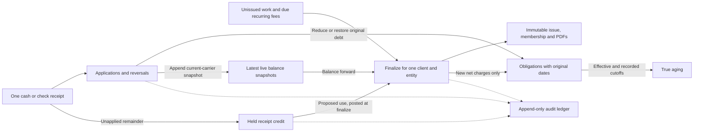

# Owner requests, round 2 — integrated design (H0/H1)

Design date: 2026-09-26; owner instructions received 2026-09-25. H0 implemented the email and scheduler switches. H1 implements the business-entity dimension described in §2, with the concrete differences below. H2 implements the receipt subledger, true aging and corrected legacy opening policy below. H3 implements general corrections and the admin-only adjustment rule. H4 implements recurring preparation, plan controls and the legacy cutover in §5. H5 implements reporting and historical labor-cost provenance in §6. H6 implements the category navigation, stable browser routes and shared workspace patterns in §7. H7 adds the combined lifecycle and API refusal/identity/funding regressions described below; H8 implements shared page help, browser/mistake repairs and final program acceptance. Later runs update this record when implementation evidence requires a deliberate change, with replacement tests and their run results. The [existing owner decisions](2026-09-24-owner-decisions.md) remain authoritative.

## Scope and invariants

Build entities, original-debt aging, one-receipt/multiple-invoice payment allocation, general corrections, recurring-charge preparation, reporting definitions and the navigation that supports them. Cash/check entry remains manual. No bank connection, QuickBooks integration, online payment, collections, interest calculation, period close or approval hierarchy is authorized. Preserve the existing printed interest line **byte-for-byte in the template**; new entity letterheads do not alter its wording or calculation.

1. **Finalize = sent and locked.** Preview and draft PDFs do not issue or lock anything. Finalize saves immutable issue payload/membership/artifacts. Originals, captured evidence and printed Audit Records never get rewritten. New events, revisions and snapshots explain corrections.
2. Keep balance-forward statements, newest-date live roots, latest child by exact PostgreSQL timestamp and ID, multiple independent same-day roots, and `absorbed_by` closing markers. Partition all of this by `(account_id, customer_id, billing_entity_id)`. Never sum old statement totals as additional debt. Original obligations survive absorption.
3. Let `B` be signed billed balance on live chains; `U` eligible unbilled billable work; `P` signed pending adjustments not already represented in B; `N = B + U + P` the next statement before newly proposed credit use. Create Invoice and Account Audit agree on N; AR agrees on B. Preview and Account Audit expose the same N before proposed held-credit use, the proposed credit amount, and the projected payable amount separately; compare their corresponding fields rather than a proposed invoice total to AR. Compare the same scope and date: AR is not WIP. Unused retainers and unapplied receipt credit are separate assets held for the customer until applied; display their available amounts alongside, never subtract them twice. After every posting, tests assert zero drift for B and N separately, per entity and in total.
4. All money uses decimal dollars at two places (integer cents inside allocation arithmetic), never binary floating-point allocation. Retain signed legacy ledger conventions: charges/reversals increase debt; payments/write-offs reduce it. New source documents use positive magnitudes with explicit event direction. Reject nonfinite, zero, excess-scale and out-of-range input. Six-minute round-up applies once to billed time; preserve actual minutes for cost analysis.
5. Every new business table gets capture and integrity triggers in its introducing migration, account ownership, customer attribution where applicable, entity attribution, and the existing audit actor context. Existing `audit_events.entity` means **table/record kind**, not a billing company; use `billing_entity_id` as the company dimension. Extend audit presentation/replay for every new event and table. System generation records `actor=system`, source and request/run ID; human decisions require a trimmed reason (1–2000 characters) and session actor, never a body or URL actor.
6. Take the existing account audit lock before business locks, then customer locks in stable ID order, then entity/obligation/credit rows in stable ID order. Use `FOR NO KEY UPDATE` as existing paths do. All financial writes, applications, snapshots, membership and evidence commit atomically. A rejected request leaves money, business rows, audit events and idempotency state unchanged. Unique, create-only artifact keys are prepared before the DB commit; failure can leave an unreferenced object, never a referenced missing file or an overwritten original.
7. All new monetary POSTs require a UUID `Idempotency-Key`; persist account/operation/key, canonical input hash and committed response in an audited request table. Same key/same input returns the original result, same key/different input is409. Failed attempts roll back the key reservation. A new key with stale `expectedVersion`/`ledgerFingerprint` is409. Reads use repeatable-read snapshots. Do not reinterpret a stale invoice/entity as another selection.
8. New routes use HTTP400 validation,401 login,403 role/account,404 missing or foreign object,409 locked/state/stale/duplicate-key conflict,500 unexpected DB/storage failure; report committed outcomes if only a post-commit export/refresh fails. Financial operators are Manager/Admin/Super Admin/legacy Owner; settings Admin/Super Admin; analytics and AI Audit retain Super Admin; Audit Record retains Admin/Super Admin. No new permission bypass or approval system.

### Planned financial flow (H1–H5, not implemented by H0)

Remaining obligations less issued statement credits reconcile to current-carrier billed balances; these two representations are never added together. Carry-forward does not create another obligation or change its date. Corrections append events to these same records as specified below.

## 1. H0 — email and automation switches

Both switches use **exact strings**, matching the owner's wording:

| `NODE_ENV` | Value absent, empty or unrecognized | `true` | `false` |
|---|---|---|---|
| `production` | enabled | enabled | disabled |
| anything else (including test/unset) | disabled | enabled | disabled |

`SEND_REAL_EMAIL` gates the single `src/utils/email/sendEmail.js` sender **before SES client construction, credential discovery or network activity**. Subject and recipient validation remains; disabled delivery does not require FROM_EMAIL or AWS credentials. A suppressed attempt logs one structured JSON entry with `event=email_suppressed`, UTC timestamp, subject, normalized to/cc/bcc and from address if configured. It resolves normally with `{suppressed:true, MessageId:null, ...}`; no caller mistakes suppression for an exception or asserts actual delivery. Enabled mode retains SES response/error behavior. The switch is evaluated on each send so even a previously cached client cannot bypass suppression.

Optional `EMAIL_OUTBOX_DIR` writes one UTF-8 JSON message per UUID, create-only, with owner-only file permissions and a private directory created when needed. It includes text/HTML for local inspection and attachment metadata only (SES basic email still does not send attachments). It never forwards mail or serves outbox files over HTTP. Unset means logging only; outbox failure emits a warning and still returns suppressed success. Operators choose a private local path, control retention and remove it when no longer needed; `/tmp/ds2-email-outbox` is the documented sandbox example. Outbox errors can never fall through to SES. No outbox is written on enabled delivery.

`RUN_SCHEDULED_AUTOMATIONS` gates app startup before `scheduledAutomations()` and also guards the orchestrator entry point. Off means no jobs are registered. On preserves Phoenix Thursday09:00, Friday15:30 and daily09:00 schedules and existing per-account enablement/recipient selection. Email and scheduling are independent: enabling the scheduler while disabling email permits local workflow inspection with suppressed delivery. These are process-environment controls, not account preference overrides. Restart the backend after changing its environment. No migration, new route, new UI, financial ledger write, lock or PDF change. H6 places settings at `/settings/automations`; `/account/automations` remains a redirect.

Every present email path uses this boundary: tracker validated/failed/system-error notices, Thursday/Friday/missing-tracker reminders, processed-timesheet success, automation failure. Tests invoke each real caller with the real sender and a **stubbed SES client**, once off and once on. Test production defaults, every explicit override, malformed flag fallback, missing FROM_EMAIL off/on, to/cc/bcc, repeated/concurrent outbox writes and I/O failure, SES rejection, disable after a cached client, and app startup without registering real timers. Test setup fixes both switches off except scoped, fully stubbed tests. No live email is a test method.

## 2. H1 — billing entities and legacy cutover

### Schema and selection

Implemented through migrations028–036; the next free number for H2 is037:

- `billing_entities`: `billing_entity_id`, account FK, name, legal_name, contact_name, email, phone, address lines/city/state/postal/country, tenant-owned logo storage key, invoice_prefix, active, is_default, version, created/updated metadata. Unique `(account_id,billing_entity_id)`, normalized name and invoice prefix within account; one active default via partial uniqueness and atomic default replacement. At least one active entity remains. No delete after references; deactivate instead. Existing references remain readable after deactivation; block new work/plans/receipts for inactive entities but permit reasoned corrections of their old records.
- `billing_entity_aliases`: account, normalized tracker text, entity, source and reason. Normalize Unicode NFKC, trim/collapse whitespace, lowercase and remove punctuation only; retain business words/suffixes, never fuzzy/LLM matching. Union exact normalized active names, legal names and aliases; **one distinct entity** is a match. Zero/multiple matches are held with raw text, candidate IDs and `entity_unknown`/`entity_ambiguous`. Admin must fix the alias or choose explicitly; do not assign default to unknown imported text. Inactive aliases do not resolve new work.
- Add `billing_entity_id` to new time/charge, write-off, payment, retainer/event, statement/invoice/issue, recurring, quote and pending-payment records, plus tracker suggestion/review provenance. New financial rows require a same-account entity through composite FKs/guards. Source tracker rows may remain unresolved only in the holding area and cannot post financial work. New obligations, receipts/applications, credits, correction and refund tables in later migrations have mandatory entity from creation.
- `legacy_financial_entity_attributions` holds immutable `(account, table, record_id, entity, cutover_id, basis)` for already frozen rows. Effective entity is the new row's column or this explicit legacy attribution; readers never silently coalesce null to today's default. Captured old payloads/JSON/PDFs and original rows stay unchanged. Mutable unbilled work can be backfilled, logged as system migration source. Unresolvable unbilled work is held, not billed under a guessed entity. Direct SQL insertion of a new entity-less financial record is refused; legacy exemption is restricted to enumerated cutover records.
- `billing_cutovers`, `billing_cutover_positions`, `billing_cutover_links`: immutable reviewed manifest, source row hashes/version/time, accountant selections, signed opening amounts, source live chain/snapshot IDs, entity, derivation and consumption links. A position is a **routing of existing opening balance**, never another charge, cash receipt or issued invoice. A source can split across entities only when the reviewed slices sum exactly to its signed latest balance. Application compares all source hashes under locks and refuses drift atomically. Tables, reclassification/consumption links and importer source are audited.
- Entity numbering uses locked `billing_entity_invoice_sequences` with `(account,entity,year)` uniqueness and a monotonic sequence. Number format defaults `<prefix>-<year>-<5-digit sequence>`; prefix uniquely identifies an entity, reserved historical collisions cause allocation to advance, never reuse. Seed default prefix `INV` without renumbering legacy invoices. New entities require an admin-selected distinct prefix. Freeze letterhead/logo digest and number into issue payload.

Manual forms show a required entity picker. Default to the selected job/plan entity, else the user's last valid selection within the current account/customer, else account default; keep the choice visible. Switching customer/entity clears invalid job, invoice, retainer and credit selections and reloads balances. Jobs may be entity-specific; a shared legacy job does not override the explicit transaction entity. Admin can reclassify unissued work with reason under locks. Already issued work uses correction documents, not reassignment.

### Cutover algorithm

Read only to produce CSV/JSON and reconciliation totals: inventory normalized tracker strings and aliases, unknown/ambiguous entries, linked unbilled work, issued artifacts, live chains/latest snapshots, existing credits/retainers, pending adjustments, recurring plans and all candidate mappings. The manifest includes stable IDs/hashes, old values, proposed entity/basis and exact row-effect counts. Account1 default is **James F. Kimmel & Associates**; create Kimmel Financial Advisors and Jim Kimmel Insurance Agency, Inc. only from explicitly reviewed spellings. Real-estate entities are admin-created when their names/letterheads are supplied. The brief reported four client-name mistakes; this snapshot has three tracker rows outside the three exact normalized known companies. The retained tracker inventory records the observed strings/counts. These are review cases, not businesses. Do not infer invoice entities from today's customer or user labels.

By owner correction on2026-09-26, every pre-cutover open item belongs together in the default business: B, eligible U, signed P, held funds, retainers and credits. Default-business N must equal the original single-scope N per client to the cent; other businesses start0. Accountants can explicitly map reviewed opening slices and funds before billing resumes. Issued historical rows/PDFs remain precisely as issued, with separate “legacy attribution” labels. Pre-cutover tracker matches are reporting attribution only: “legacy attribution: tracker entity”, otherwise “unattributed legacy work”. No pre-cutover work is held for business review. Only newly recorded work requires a business or an unresolved-tracker hold. Admins may explicitly reassign specific unbilled legacy work with a reason; the candidate report selects tracker-different work dated after the last issued statement and performs no move. Existing valid recurring plans get the default entity, description “Recurring services” when absent, and first automated period on/after the recorded cutover date. Show these defaults in the report; do not require staff to re-enter existing valid plans. Hold invalid/unsupported recurring plan data and unresolved choices on post-cutover work only. Do not fabricate earlier entity-specific invoices or cash movement.

At cutover the rolling resolver uses unconsumed opening positions **instead of**, never in addition to, their source chains. This lets an accountant split one old aggregate balance without rewriting it. The first entity statement absorbs each carried position using immutable consumption links and the existing closing-snapshot/absorption mechanism; a shared source chain closes only when every slice is consumed. Each new position snapshot and consumption is entity-scoped. Pending adjustments included in a position are membership-listed so they cannot re-enter P. Legacy raw-chain readers must all change together: invoice eligibility/engine, payment/write-off cores, AR, Account Audit, Audit Record replay and profile summaries. H1 acceptance fails if any caller adds both position and source chain.

Before application show per-client/entity `B`, `U`, `P`, unused retainers and credits and all-entity totals; after application totals must equal before to the cent, and original artifact hashes must match. Unresolved unbilled rows visibly block that work's billing; do not block a client's unrelated resolved entity. Report every account1 changed row by table/ID/field and every inserted attribution/position. No source deletion, balancing fudge or unexplained arithmetic repair. Existing unresolved historical discrepancies stay in the review report and are excluded from automatic approval.

**H1 reconciliation clarification:** holding unresolved work changes *eligible* U/N, so conservation includes the separately reported held eligible work. The local original physical rows reconstruct B41,015.00/U1,513,217.50/P−1,493,344.00/N60,888.50 with5,472.00 held funds. After attribution, eligible U505,977.25/N−946,351.75 plus1,007,240.25 held eligible work reconcile exactly; B/P/funds do not change. Total unresolved work is1,007,598.25, including358.00 not currently eligible. These large historical pending adjustments are retained for accountant review, not corrected or newly refunded. The before values are a recomputation from hash-verified unchanged sources, not a captured pre-migration engine run. CSVs preserve the per-client/entity amounts and the report labels this limitation. Original remote artifact hashes cannot be independently checked in this AWS-prohibited sandbox; original source rows/paths remain unchanged.

### API, screens, evidence

New session-account routes: `GET/POST /billing-entities`, `GET/PATCH /billing-entities/:entityID`, `POST /billing-entities/:entityID/aliases`, `DELETE /billing-entities/:entityID/aliases/:aliasID` (audited removal of unused alias), `GET /billing-entities/review`, `POST /billing-entities/review/:entryID/resolve`. Static review paths register before ID paths. Reads needed for financial pickers admit financial operators; administration/mapping is Admin/Super Admin. PATCH requires reason/version; referenced/inactive/default conflicts are409. Logos use existing tenant-authorized storage upload/download helpers, with size/type validation and unique keys.

Extend existing work/ledger/invoice/customer/AR/Audit/analytics list and export routes with optional `entityId` (`all` or absent only on aggregate reads); financial writes require entityId after cutover. Account scope always comes from session. Entity filter on Audit Record includes company changes from that client's own atomic postings and transfer counterpart references without losing account-chain verification; full chain integrity still verifies the whole account. H1 introduces no permission expansion for reports.

Screens: Settings → Billing entities (list/editor/default/letterhead preview); Time & Work → Needs review includes Entity review; required picker on affected forms; entity chips/filters on client tabs, statements, AR and audit. Canonical routes are in §7. Entity statements print frozen letterhead and numbers; all-entity reports use the account header and separate entity subtotals. Never produce one payable invoice combining legal entities. Test deactivate/default races, foreign logo/entity/job IDs, unknown/ambiguous aliases and case/punctuation, wrong-entity selection reset, legacy split/carry-forward, duplicate number races, byte-preserved originals and three-view zero drift.

### H1 implementation decisions and addendum

H1’s [feature contract](../platform/billing-entities.md), [hand oracles](../scenarios/H1-business-entities.md) and [run results](2026-09-26-run-H1-results.md) define the shipped local behavior. The schema uses transaction-local `billing_scope` read views and explicit sidecars to preserve all original account1 fields. Unbilled work with exactly one verified tracker source is attributed through a sidecar; unresolved work is held. Default-routed billed balance uses the existing chain once. Reviewed `billing_cutover_allocations` substitute business slices for that chain; payments/write-offs append scoped children before the next statement, and finalization records immutable allocation/position consumption. Original source parents and pre-cutover children remain unchanged for default and split routing.

H1 adds 17 session-account routes under `/billing-entities`, including `/balances`, `/transfers`, `/work/:transactionID`, `/cutover` and logo read/upload. Settings/review/opening balances are admin-only. New pages are `/settings/entities`, `/settings/entities/new`, `/settings/entities/:entityId`, `/settings/entities/cutover`, `/work/review/entities` and `/payments/transfers`; H6 provides compatibility redirects from previous page routes. Work reassignment retains its current job; an admin must first move work from a business-specific job to a shared job through Edit work. This avoids changing job totals outside the existing ledger edit machinery. Existing finalized records cannot switch.

H1 credit transfer moves currently available retainer/prepayment balances only, with equal source/destination evidence, reason, source snapshot and UUID key. It creates no payment/cash row. H2 must extend the same operation/idempotency model to its future credit lots and preserve transfer lineage; it must not reinterpret destination transfer roots as new receipts. H1 does not transfer issued statement credits as held funds. Statement aging and current-rate analytics definitions remain for H2/H5 to replace.

**Owner addendum, 2026-09-26:** “On the approvals, no second person needed for approval. Any and only of the admins can apply write offs and adjustments” and “Over all item 6 doesnt need done.” No period close or approval workflow is authorized. Only existing `admin` and `super admin` roles, case-insensitively through `requireAdmin`, may create/edit/delete write-offs; post retainer refunds/adjustments, credit memos, void/rebill, client-credit refunds or cross-business transfers; flag/reverse/revise/roll forward bounced checks; or remove duplicates holding money. Any one admin may act alone. Managers/employees keep read access; duplicate flag/dismiss, time/charges, received payments and invoice creation/finalization keep existing permissions. H1 enforces this on transfers now. H3 implements the retrofit of existing write-off, retainer-event and monetary duplicate-removal routes/screens. Bounced-check actions already guarded by H2 retain that guard. Existing financial read permissions remain; no extra employee financial access is introduced. Both admin roles act alone, case-insensitively.

Migrations030–036 are forward refinements to the initial028/029 implementation: tracker/audit attribution and constraints; pending-import choice and account teardown; reviewed slices; generic trigger row handling; saved Audit scope; default-opening protection; and update passthrough for ordinary mutable invoice rows. No applied migration was edited. H2 starts after036. Original account1 field values and row counts are hash-compared with the retained pre-H1 census. Original remote PDF bytes were not retrieved because AWS is forbidden; their stored paths and source rows are unchanged, and generated synthetic PDF bytes/layout were checked locally.

## 3. H2 — obligations, one receipt and true aging

### Subledger beneath statements

H2 forward migrations (starting at037, verify before writing) introduce append-only `ar_obligations`, `payment_receipts`, `ar_applications`, `client_credit_lots`, `client_credit_events`, `receipt_events` and cutover derivation evidence, and reuse H1’s audited `financial_requests` table. Use same-account/customer/entity composite relationships. Obligations have ID, original invoice/issue ID (or cutover source), positive face amount, obligation_date, due_date, effective date, posted timestamp, source kind and derivation label. Every issued statement contributes **only its newly issued net charges**, excluding balance forward and payment/retainer/credit applications. Preserve gross charges and price/write-down components for reporting; never create a new obligation for carried debt. Negative new net charges become a separately identified credit event/lot; zero creates none. No statement can mint both gross and net obligations for the same work.

Applications record source receipt/credit/write-off/retainer event, obligation, positive amount, effective date, posted time, reversal_of, current carrying chain and compatibility posting ID. Every application is immutable; reversing adds an equal opposite event referencing it. Require source and target entity equality. Outstanding obligation = face + signed correcting events − net applications as of cutoff. Application caps, credit availability and receipt remainder are checked under locks; sum of all original receipt allocations plus remaining/disposed credit equals its gross amount. Receipt headers are immutable immediately on posting; correct an unissued mistake by reasoned reversal and replacement, not editing money. Keep legacy editor routes for true legacy unissued rows, but return409 with receipt link for new receipt-backed rows.

`payment_receipts` records gross positive amount, date, method (`check`, `cash`, `other`), reference (required for check/other; optional cash note), customer/entity, source/import ID and actor. New Receive payment cash is entered here; the compatibility entry points described below remain supported. Retainer draws and later use of receipt credit are **applications, not new cash receipts**. Existing compatibility `customer_payments` rows represent allocated debt reductions once; excess goes to a credit lot, not a second receipt or duplicate automatic retainer. Credit lots distinguish `held_receipt` (not yet in B) from `statement_credit` (already deducted in B). Credit memos exceeding their remaining obligation and negative issued charges create statement_credit. Using statement_credit reduces both its available amount and the target obligation by the same amount; it changes neither B nor N again. Compatibility lines are display/membership evidence, not a second deduction. Using held_receipt reduces B only when applied. New credit lots are distinct from existing explicitly managed retainers. Preserve old retainer/excess links and events; legacy mapping must not create spendable credit twice.

H2 implementation adjustment: existing explicit retainer funding, the single-payment form and payment-image approval retain their established interfaces and retainer handling. They synchronize reductions into obligations and remain explicitly identifiable compatibility sources. They are not silently converted to a second spendable credit lot or receipt. The new Receive payment flow is the primary entry point for multi-invoice cash. H5 must combine these source kinds explicitly when reporting cash and collections. Do not create both an ordinary credit lot and a retainer balance for the same held money. Map identifiable legacy root deposits as labeled derived receipts without rewriting those roots. Draws keep source-funding lineage (oldest funding event first), so receipt-backed draws count as applied collections once; noncash retainer adjustments and their use remain separately classified. Retainer refunds retain the existing event route and link to the same source funds for cash-return reporting. Existing consumed-overpayment-retainer reversal restrictions remain in force.

Receipt excess is **held credit** until the next billing; it does not make a positive AR aging bucket negative. AR shows gross remaining obligations, already-issued statement credit and unapplied credit separately; `B = obligations remaining − issued statement credit`. Unapplied receipt credit/retainers are displayed separately from B. A preview may show proposed automatic use of held credit and the resulting invoice total, without writes. Finalize posts that exact use atomically and captures it in membership. Spend oldest available credit by effective date/ID against oldest existing obligations, then this statement's new obligation; never apply more than total positive debt. Unused remainder stays held. A signed credit statement remains optional under the earlier decision and must not itself create another credit asset.

### Payment flow and endpoints

`GET /payments/open-obligations?customerId=&entityId=&asOf=` returns original invoice/date, carried-on current statement, open cents, row version, ordered `(obligation_date, original_invoice_id, obligation_id)`, plus a ledger fingerprint. Historical absorbed originals are valid obligation targets; snapshot updates still affect their **current carrier**, not the frozen old parent. The screen calls them “Open invoices” and explains carried-on references in detail.

`POST /payments/receipts` accepts customer/entity, gross amount/date/method/reference, allocation lines `{obligationId,amount}`, reason for overriding the oldest-first suggestion, fingerprint and idempotency key. Receive payment defaults oldest first, capped per line, with Received / Applied / Remaining credit totals. Operators can adjust or clear lines; zero lines and fully held credit are valid with a reason when payable obligations remain. Reject duplicate obligation IDs, wrong invoice/entity/client, negative line, sum over receipt or obligation, future payment date, stale balances or inactive entity. Confirmation shows each invoice's before/after and remaining credit. Post one receipt, all applications/compatibility snapshots and one excess lot in one transaction. Source pending-payment approval calls this same service once; no legacy two-step approval.

Other routes: `GET /payments/receipts` (paged filters), `GET /payments/receipts/:receiptID`, `POST /payments/receipts/:receiptID/reversals`, `GET /credits?customerId=&entityId=`, `POST /credits/transfers`. Receipt level duplicate flags use existing `/duplicates` resources extended with kind `payment_receipt`: matching check reference/date/entity/customer/amount creates a warning requiring reason to proceed, never silent double-post. Exact import source uniqueness and idempotency are stronger than heuristic duplicate review. Flag/dismiss is nonmonetary; “remove” posted receipt means the authorized compensating correction, not DELETE.

Cross-entity credit transfer is explicit within the same account/customer: source lot, amount, target active entity, reason, versions. It appends equal credit-out/in legs and lineage to one transfer, locks both sides, creates no cash or revenue and never rewrites old receipt ownership. Reject insufficient/reserved funds, self-transfer, foreign client/entity or double submit. No automatic cross-entity netting. Show both entities in detail/Audit Record. A transferred receipt's lineage must remain reversible or cause an atomic conflict.

### Bounced check and locks

For an issued receipt/application use the existing flagged `bounced_check` exception and reasoned reverse → revision/roll-forward state machine, extended to select **one complete receipt** and all its applications/membership. A multi-invoice receipt cannot be partially bounced. Reverse every allocated amount, restoring each original obligation age; cancel its unused excess. If excess has since been applied or transferred, reverse identifiable downstream applications/transfer legs in the same transaction only when fully traceable and still available. If any has been refunded or an unrelated correction makes the reversal unsafe,409 with affected records and corrective guidance; no partial reversal or negative available credit. Retainer-funded applications are not bounced checks. Legacy overpayment retainers retain the existing untouched-funds requirement; their consumed-funds refusal is not relaxed by the new receipt service. Legacy single-payment exceptions remain supported through an explicit receipt mapping, never an invented check grouping.

Current-carrier snapshots receive each reversal exactly once. Original receipt, statement and PDF stay frozen. Reprint is permitted only on current live chains per existing rules, packages untouched originals plus clearly identified revisions for every affected issue; otherwise roll forward. The entire receipt reversal is committed before separate artifact resolution; storage failure leaves the already-reversed exception visibly unresolved/retryable, not a second money posting. Audit links receipt, all applications, reversals, exception and revisions.

### H2 implementation evidence and compatibility

Migrations037–041 add the reasoned cutover amendment and obligation/receipt/credit ledger. The original H1 manifests remain immutable; superseding manifest9 (amendment1) restores67,307 legacy scopes to account1's default business without changing original rows. The next free migration is042. See [H2 results](2026-09-26-run-H2-results.md) for accepted tests and [receipt contracts](../ledger/receipts-and-obligations.md) for actual routes. Admins can cancel an entire unissued mistaken receipt without an NSF claim, then enter its replacement. A single application correction preserves its amount and changes its target before finalization. Legacy headers are descriptive evidence and use their linked source correction workflow; their allocations are never guessed into one historical check.

### Legacy derivation and as-of aging

Cutover planner walks original issued statements chronologically `(invoice_date,created_at,id)`, derives **incremental** charges from their frozen new-charge components rather than total due, and reconstructs known payment/write-off/retainer events without recounting their mirrored snapshots. Exact existing links win; remaining unlinked reductions allocate oldest first within the reviewed entity. A standalone legacy payment row is one derived receipt; do not guess that equal references represent one historical check. Stable source keys and manifest hash make reruns idempotent.

Reconcile each entity's derived outstanding to its reviewed opening B and held funds. Missing/malformed/contradictory evidence becomes a separately labeled **legacy unresolved opening obligation** at the oldest verifiable supporting invoice date; if no reliable date, use an `unknown_age` bucket, not today's date. Do not invent cash to plug differences. The report identifies the residual, candidates and deterministic FIFO estimate for accountant review. A balanced default derivation with explicit unknown-age labeling may be applied locally under this program’s backfill authorization; contradictory evidence that cannot satisfy the reconciliation invariants stays held, with no balancing fudge. Negative opening B maps to issued statement credit, not negative debt. Accountant corrections are new effective events with reason, not edits to frozen originals.

AR `GET /accountsReceivable/aging/:accountID/:userID` and `GET /accountsReceivable/aging/:accountID/:userID/export` gain `asOf=YYYY-MM-DD`, `recordedThrough=UTC timestamp`, `entityId`. Extend these existing routes; do not create a second report implementation. Buckets use Phoenix date differences from each obligation_date:0–30,31–60,61–90,91+, plus unknown-age; exclude not-yet-effective obligations. Sum remaining positive cents individually; show credits separately, never age net customer balance from MAX invoice date. All applications/corrections have effective and recorded times. A report records both cutoffs: reproduce “known at the time” with recordedThrough, or a restated past date with today's recorded cutoff. Backdating cannot precede its source or target obligation (prepayments stay credit until debt exists). New finalized invoice dates cannot precede the latest issued entity statement without a correction workflow. Pre-cutover historical outputs explicitly say reconstructed/estimated and expose unresolved data. All-entity totals sum entity rows without netting companies.

PDF statements show one receipt summary, invoice allocation detail on demand, remaining credit and automatic credit use; carried balances retain original ages in AR/audit reports. Existing issued PDFs are unchanged. Required money oracle: Jan1 invoice100, Feb1 invoice80, Mar1 invoice50, Mar15 receipt150 → Jan0/Feb30/Mar50 (remaining80); as of Mar20, Jan age78 contributes0, Feb47 contributes30 to31–60, Mar19 contributes50 to0–30. A receipt100 instead pays30+50 and leaves20 credit; next new charge35 uses20 and issues15. Bounce the first150 before the second receipt: original100/80/50 reopen, aged by original dates. Test allocations out of FIFO with reason, pennies, credits without invoices, transfer/refund dependencies, repeated retries, simultaneous application and finalize, and each historical cutoff before/after reversal.

## 4. H3 — general corrections

H3 uses migration042 after H2 and adds immutable `credit_memos`, `credit_memo_lines`, `invoice_voids`, `rebill_links`, `client_refunds`, `credit_memo_reversals` and `correction_postings` relationships, all with entity, reason/session actor, source IDs, effective/recorded dates and idempotency evidence. Extend issue membership, audit capture/replay and duplicate resolution. “Void” is a derived status from invoice_voids; do **not UPDATE the frozen invoice row**.

**Credit memo.** `POST /invoices/:invoiceID/credit-memos` accepts positive amount, reason and matching entity, optionally charge-line allocation; `GET /credit-memos` and `GET /credit-memos/:memoID` list/read. Only finalized, nonvoid originals with remaining uncredited new charges qualify. Cap cumulative credits at that invoice's original net charges, not balance forward. Reduce its open obligation first; paid excess becomes client credit with source memo. A credit memo is not cash and is not also a write-off. The next statement shows the memo number/original invoice/reason and amount exactly once, even if its debt reduction is already in a child snapshot. Archive a credit document; no edit of the old PDF. Lock memo immediately; correct an error with a linked compensating event, never a negative-input hack.

**Void and rebill.** `POST /invoices/:invoiceID/void-rebill/preview` is read-only and returns impact/fingerprint; `POST /invoices/:invoiceID/void-rebill` atomically archives the correction artifacts, records void/reversal and issues the corrected invoice with a **new number**. Requires reason, replacement editable charge lines/entity and current versions. Do not void an invoice's brought-forward amount: reverse only its new net charges/issued credits and retain independent payments. Payments already applied to the voided obligation move, with traceable reversal/reapplication, to the corrected obligation in the same entity, with excess held as credit; no new cash. Later statements are never rewritten. A voided older/absorbed invoice produces corrections on the current carrier. A wrong-entity rebill reverses source charges and issues target charges, but cannot silently move cash/credit: require explicit transfer in the submitted preview and reason, or retain funds in source. Freeze original charge evidence; replacement rows reference originals, preserving time/cost provenance without counting work twice.

Reject an already voided invoice, stale preview, replacement with no valid billable basis, unresolved competing exception, source-credit already refunded/consumed beyond safely reversible lineage, invalid/foreign related IDs and storage failure. An original with credit memos has its remaining uncredited amount voided; prior memos remain once, and a preview that cannot reconcile refuses. Reserve numbers under locks, use unique artifacts, rollback all money on posting failure. A client sees Original — void, reason, correction and Replacement links. New replacement finalization is sent/locked immediately. All-entity debt less held receipt credit changes only by the declared corrected charge delta. If the admin retains released funds in the original business, gross billed debt and held funds can both increase by that amount; the preview discloses both balances.

**Credit refund.** `GET /credits/:creditID/refundable` and `POST /credits/:creditID/refunds`, plus `GET /refunds`, accept positive amount ≤available, date, method/reference, reason/version. Journal money returned, reduce held credit and track its receipt/memo source. No bank API; no deletion or synthetic customer payment deduction. Refund of issued statement credit increases signed B toward zero; refund of unused receipt credit only reduces held funds. It never reopens unrelated debt or changes obligation ages. Explicit retainer refunds continue using `retainer_events`; share presentation, not double posting. Refuse future/before-source dates, exhausted credit, wrong entity, duplicate key, simultaneous application/refund and storage/DB errors.

Screens: Billing → Credit memos; invoice detail → Credit memo / Void and rebill preview with impact confirmation; Payments & Credits → Credits, Refunds and Transfers. Show immutable history/reason/actor and original/replacement PDFs. Oracle: invoice100, receipt100 → debt0; memo30 → credit30; refund10 → credit20 and cash returned10; future charge50 uses20 → debt30. Void100/rebill120 after full receipt100 → debt20, collected cash remains100. Repeat with absorbed originals, partial payment, prior memo and different entities. Every API unhappy branch proves unchanged financial rows and audit event count; Jest/Playwright prove bad amount, stale/double click, wrong entity and artifact recovery behavior.

H6 places H3 Credit memos under Billing, and Client credits / Refund history under Payments & Credits. [Correction rules/routes](../ledger/invoice-corrections.md), [oracles](../scenarios/H3-corrections.md), [results](2026-09-26-run-H3-results.md). Rebill charge lines are immutable JSON in `rebill_links` and the replacement issue payload; original source evidence is retained without duplicating employee work. Credit beyond open debt requires explicit confirmation. Memo reversal is a locked compensating document. New artifacts use private `corrections/account/customer/UUID.pdf` keys and verified SHA-256. Migration042 has no source-data backfill.

## 5. H4 — recurring charges ready for billing

H4 uses migrations 043/044 and extends **existing `recurring_customers`**, not a competing plan table: entity, job_id or required description, frequency enum `monthly|quarterly|semiannual|annual`, anchor_start_date, bill_day1–31, effective end, version, first_automated_period, activation/review metadata. Map known `Monthly` case-insensitively; hold unsupported frequencies. Add unique `recurring_charge_occurrences(plan_id,period_start)` with account/customer/entity, due_date/period_end, snapshotted fee/description/version, transaction_id, state (`generated|skipped|issued`), reason and generation source. Occurrence history is append-only/audited. Generated transaction is an ordinary billable **charge** with source occurrence, quantity1 and the period fee, not fictitious staff time.

Period cadence advances1/3/6/12 calendar months from the anchor. Due day clamps to last day of the target month (31→Feb28/29); no prorating or weekend shifts. Start/end boundaries inclusive; no generation before first_automated_period or after end. Fee >0 with cents, job belongs to same customer/entity if given; description-only generation must work through invoice grouping (replace current inner-join assumption with a supported charge line, not dropped work). Editing a plan affects future ungenerated periods only. Historical occurrences snapshot prior fee/entity. Moving entity after generated history ends the old plan and creates a new one with explicit start; no rekey of issued occurrences.

Mechanism: on opening Create Invoice the UI first calls **POST `/recurringCustomer/prepare`** with billingDate/entity filter, then GETs eligibility/preview. GET never mutates. Finalize invokes the same prepare service *before* acquiring its read/pricing snapshot, so API callers cannot omit due fees; a newly generated fee invalidates a stale review fingerprint and returns409 with refresh instructions. Mere PDF preview remains read-only. Optional daily scheduled backstop calls that service with `system` source only when RUN_SCHEDULED_AUTOMATIONS is enabled. Thus fees are ready with scheduling off. Unique occurrence keys and row locks defeat simultaneous opens, backstop/finalize races and retries.

Catch-up cap is **12 due periods per plan per prepare**, oldest first. Response includes generated/skipped/remaining counts, exact periods and `catchUpRequired`; billing that plan's entity is blocked while eligible due periods remain or an active plan is held for review. Explicit `POST /recurringCustomer/:planID/catch-up` with reason processes another batch or records explicit skipped periods. Never discard old periods or generate years of bills silently. Existing eight active plans default first automated period to the first due date **on/after the recorded rollout date**, with default description “Recurring services”, a report of earlier periods and optional explicit reasoned catch-up; no historical auto-billing just because start_date is old. These excluded legacy periods do not block current billing and require confirmation before catch-up generation.

Extend existing plan create/update/read routes with these fields and strict booleans/ownership/version. New `GET /recurringCustomer/due`, `POST /recurringCustomer/prepare`, `PATCH /recurringCustomer/occurrences/:occurrenceID` (amount/description with reason before issue), `POST /recurringCustomer/occurrences/:occurrenceID/skip` (reason) and catch-up route use financial-operator role. Skip leaves audited tombstone so another prepare does not regenerate the charge; issued occurrence is locked and needs H3. Ordinary delete of generated work routes to skip, not deletion of uniqueness evidence. Deactivate a plan leaves pending occurrences visible for explicit disposition.

`customer_transactions.is_excess_to_subscription` means **outside the subscription**, as proven by `SharedTransactionsFunctions.handleBillableStatus` and `transactionsObjects`: covered recurring work defaults nonbillable; excess defaults billable. Preserve that field and independent billable choice. Covered time still records actual effort and cost for margin. Generated periodic fee is billable but is **not excess**. Do not flip old covered time to billable, subtract its value from the fee, or mark all work recurring based only on the customer's global boolean; resolve coverage to the selected entity/plan and let users explicitly choose excess.

Screens: Billing → Recurring plans list/editor; Create Invoice → ready recurring charges with period, fee, edit/skip reason and catch-up badge. PDF lists period and fee normally; skipped occurrences are audit-only; no duplicate fee on balance forward. Oracles: monthly125 for Jan–Mar yields375 exactly once; edit Feb to100 and skip Mar with reason yields225, repeated prepare still225; covered time60 is informational while excess40 makes265. Test leap years/day31, quarter/semiannual/annual, end/start, old plan cutover, description-only plan, deleted/inactive job, all concurrency and off-scheduler entry paths. H4 must update UI Jest/Playwright before H6 navigation work.

H4 implementation notes (2026-09-26): migrations043/044, nine canonical routes and `/billing/recurring` list/detail are implemented. H6 exposes recurring plans under Billing, and the legacy bookmark redirects. Existing embedded customer plan payloads remain compatible; generated plans use the canonical versioned/reasoned controls. A legacy no-change save permits unrelated customer edits. The 12-period cap applies to each preparation, including reopening; explicit catch-up can generate or permanently skip selected periods. Excluded pre-cutover periods are visible and require explicit confirmation but do not block current billing. The 044 guard preflight must run before043 on a populated legacy installation. Eight local plans retain fee/calendar inputs and first automate Oct1 after the Sep26 cutover. No financial source rows are rewritten. [Rules](../work/recurring-billing.md), [oracles](../scenarios/H4-recurring.md), [results](2026-09-26-run-H4-results.md).

## 6. H5 — reporting and historical labor cost

H5 implements migration045 and stores `cost_rate_snapshot`, `cost_rate_source` (`recorded|estimated|unknown`), `cost_snapshot_at`, actual_duration_minutes and billing-rate/standard-value snapshot where absent, on work/source tracker provenance. Capture staff cost when work is first recorded, including nonbillable covered work and held tracker rows. Manual recorded work uses logged-for staff, not session actor. Ingestion later copies source snapshot; approval does not recapture today's rate. Editing duration recalculates cost using the retained rate; assigning a different staff member before issue explicitly captures that person's rate with audit reason. Already issued work never changes. User rate changes affect future work only.

Do not mutate locked historical rows to backfill rates. Add immutable `legacy_work_cost_estimates` sidecar keyed to original work/source, snapshot the known rate once at migration cutoff with `estimated` label and source, or `unknown` when missing. Do not call a current-rate estimate historical fact. Mutable legacy rows can receive equivalent labeled snapshots with audited migration source. Source deduplication prevents counting tracker and posted transaction copies twice; corrections/void/rebill preserve original work identity so effort is not duplicated. Retain the estimate flags in exports and drilldowns.

| Measure | Definition and date basis |
|---|---|
| Work entered | Recorded actual hours and standard value of work by service date, billable and covered/nonbillable shown separately. Never label this “billed.” |
| WIP | Eligible billable work not on a finalized statement as of cutoff; show held/unresolved work separately. Real historical WIP uses issuance/event times, not today's null invoice link. |
| Gross billed | Newly issued charge components on finalized statements by issue date, excluding balance forward, receipts, retainer/credit applications and duplicate snapshots. Drafts0. |
| Net billed | Gross billed less post-issue credit memos/voided charge components by their effective dates, plus corrected rebills once. Show corrections separately. Prebill concessions are already in new net charges and not deducted again. |
| Collected | Net receipt-backed applications to obligations by application effective date, including later application of previously held receipt money; reversals negative. Exclude pure retainer transfers, noncash retainer adjustments and memo credits and show them separately; receipt-backed retainer draw applications count once. Also show gross cash received, cash returned and held receipt money so collections are not mistaken for cash deposits. |
| Write-offs / credits | Separate bad-debt write-offs, prebill concessions, credit memos, held receipt credit, retainer use and refunds by explicit source kind. Avoid counting every negative legacy row as cash. |
| Billing realization | Net billed charge cohort / standard value of the same billed work, percentage; no denominator → N/A. Recurring/fixed fees and covered effort are separately identified; allocate fee across covered work for cohort analysis only with an explicit documented basis (default proportional standard value). |
| Collection realization | Net receipt-backed applications to the selected issue cohort / collectible net billed charges of that cohort; include as-of cutoff and credits/write-offs separately. Period cash divided by period bills is not this metric. Denominator≤0 → N/A. |
| Margin | Net billed cohort less labor cost of the work/covered effort supporting that cohort. Labor cost = actual minutes/60 × stored cost snapshot (fallback recorded quantity only if actual minutes unavailable, labeled estimated). Charge-only lines have no invented labor hours. Margin%=margin/net billed, denominator≤0 → N/A. Show estimated/unknown cost count and affected amount; never report missing cost as reliable zero. |

Extend existing `/analytics/*` reads/exports with entityId and documented service/issue/application date windows, asOf/recordedThrough where historical. Preserve Super Admin gate. Add `GET /analytics/billingPerformance/:accountID/:userID` and `/export` for the reconciled definitions; old `total_billed` becomes issued-net semantics with explicit `work_entered_value` field and a documented versioned response change plus frontend/test updates. Existing client rates, WIP, time allocation, job budget and tax capacity pages use the same definitions. Audit/AR use their independent reconciliation implementations to catch drift, not merely call the same total function.

Reports → Billing performance shows Work entered / WIP / Billed / Applied receipts / Held credit / Corrections / Margin with definition tooltips, cutoff, entity and estimated badges. CSV/PDF exports carry the same basis, group totals and labels; spreadsheet formula injection protection remains. Oracle:2 actual hours at snapshotted cost30 → cost60; standard work200, issued180 → realization90%, margin120/66.67%; later staff cost50 does not change60. One unbilled standard100 stays WIP100, never billed280. Receipt120 → applied collections120, not another bill. Legacy missing snapshot at rate30 shows estimated60, with unknown costs explicitly separate. Test rate edits, retroactive service dates, held ingestion, covered recurring effort, reversal/refund, wrong entity and as-of replay/export parity.

### H5 implemented decisions and verification

H5 uses definition version2, preserves the Super Admin gate, adds the two Billing Performance GET/export contracts and implements the six report screens/year-end packet. The canonical new page is `/reports/billing-performance`, with `/analytics/billingPerformance` retained as compatibility. Historical rates live only in the immutable audited `legacy_work_cost_estimates` sidecar; no original source field is backfilled. New uploads set the validated owner as matched staff before snapshot capture, including same-name employees; approval copies the original cost rather than recapturing it. Quantity-only duration is labeled estimated even if its rate was recorded. Unknown supporting cost makes margin unavailable.

The statement's business issue date is the revenue event date; issue timestamps and audit replay enforce Recorded through. Selected-period net billing and selected-issue-cohort net billing are distinct outputs, since later corrections can affect prior cohorts. All six reports retain historical inactive staff/businesses. Billing Performance exposes full service/effective/knowledge controls; WIP and budget screens expose historical cutoffs. Raw tracker categories follow immutable worked-for attribution, including historical default-billed work. Stored exclusions are account-keyed and stale account requests cannot replace current choices.

H2 compatibility cash remains source-derived: original deposits/payments are gross cash, exact applications are collections, derived headers and transfers are not new receipts. Restored retainer draws preserve cash/noncash lineage. Recurring fees allocate across covered effort proportionally to standard value for cohort analysis. Pure charge lines do not invent labor. CSV gives complete drilldown; PDF gives matching totals/definitions and points to CSV detail. The year-end reports share their requested year, business and cutoffs; AR retains independent reconciliation with those cutoffs.

[H5 oracles](../scenarios/H5-honest-analytics.md), [feature/API contract](../invoicing/analytics.md) and [results](2026-09-26-run-H5-results.md) record exact math, failure paths, migration effects and full validation. No period close, second approver or change to H3's admin-only adjustment rule is introduced. Migrations045/046 capture provenance and audited review corrections. Actual minutes supplied by manual forms are preserved; quantity-only input remains estimated. Held-entry staff changes require a reason; ordinary matching preserves the initial rate, including unknown rates. Reviewed minutes are recorded on the source and copied at posting. Inventory45 files002–046;047 is next free.

## 7. H6 — navigation and shared page contracts

H5 visual review records one shared-shell follow-up for H6: with the desktop sidebar expanded, the global header title can sit underneath it. The Billing Performance page's own title, filters, totals and grids remain readable. H6 aligns the shared header/content offsets; its browser suite checks expanded/collapsed desktop and narrow navigation. This leaves H5 reporting definitions and calculations unchanged.

H1–H5 create their new pages at these canonical paths immediately and expose links from the corresponding existing menus/client tabs; H6 reorganizes navigation and redirects existing pages. Reuse existing Material UI layouts, `Components/DataGrids/PaginationGrid.js` (`DataGridTable`), `CustomToolbar.js` with its `renderToolbarContent` composition, `CreateInvoiceGrid.js`, sent-lock columns and shared amount/date/customer controls. Page data is local to each query; paginated subsets must **never overwrite bootstrap/shared customer context**. Use stable database IDs, not array positions, and shared composable text/entity/client/date/status filters with clear/reset, combined AND semantics and reset-to-first-page. Account-key persisted filters prevent leaking choices across logins. Cancel stale requests and retain editable inputs after a recoverable failure. Every POST has one in-flight action, retry-safe key and success refetch.

| Group | Canonical pages |
|---|---|
| Clients | `/clients`, `/clients/:customerId` with Overview, Work, Jobs, Statements, Receipts, Credits & retainers, AI Audit, Audit Record tabs; entity/all filter persists within this client only |
| Time & Work | `/work/entries`, `/work/jobs`, `/work/review` (including unresolved entities), `/work/duplicates` |
| Billing | `/billing/create`, `/billing/invoices`, `/billing/invoices/:invoiceId`, `/billing/quotes`, `/billing/recurring`, `/billing/recurring/:planId`, `/billing/credit-memos` |
| Payments & Credits | `/payments/receipts`, `/payments/receive`, `/payments/receipts/:receiptId`, `/payments/imports`, `/payments/credits`, `/payments/retainers`, `/payments/refunds`, `/payments/transfers` |
| Receivables | `/receivables/aging`, `/receivables/write-offs`; no collections workflow |
| Reports | `/reports/billing-performance`, `/reports/client-rates`, `/reports/time-allocation`, `/reports/wip-aging`, `/reports/job-budgets`, `/reports/tax-capacity`, `/reports/account-audit` |
| Time Tracking | `/time-tracking/upload`, `/time-tracking/history`, `/time-tracking/trackingAdministration/*`; staff retain only permitted own-data access |
| Settings | `/settings/entities`, `/settings/entities/:entityId`, `/settings/account`, `/settings/users`, `/settings/automations`, `/settings/job-categories`, `/settings/job-types`, `/settings/work-descriptions`, `/settings/tracker-template`, `/settings/tracker` |

Old-to-new map (React replace redirects, preserving query/hash and IDs):

| Existing path | Target |
|---|---|
| `/customers/customersList` | `/clients` |
| `/customers/customersList/customerProfile/:id/*` | `/clients/:id/*`; customerInvoices→statements, customerTransactions→work, customerJobs→jobs, customerPayments→receipts, retainersAndPrePayments→credits, editCustomerProfile→edit; aiAudit/auditRecord keep tab names |
| `/customers/recurringCustomers` | `/billing/recurring` |
| `/transactions/customerTransactions/*` | `/work/entries/*` |
| `/transactions/customerPayments/*` | `/payments/receipts/*`; legacy edit/delete/reverse routes resolve selected record to receipt or guarded legacy form |
| `/transactions/pendingPayments` | `/payments/imports` |
| `/transactions/customerRetainers/*` | `/payments/retainers/*` |
| `/transactions/customerWriteOffs/*` | `/receivables/write-offs/*` |
| `/transactions/possibleDuplicates` | `/work/duplicates` with record-kind filter |
| `/transactions/employeeTimeTrackerTransactions/*` | `/time-tracking/trackingAdministration/*` |
| `/jobs/jobsList/*` | `/work/jobs/*` |
| `/jobs/jobCategoriesList/*`, `/jobs/jobTypesList/*`, `/jobs/workDescriptionsList/*` | `/settings/job-categories/*`, `/settings/job-types/*`, `/settings/work-descriptions/*` |
| `/invoices/invoices` | `/billing/invoices` |
| `/invoices/invoices/invoiceDetail/*` | `/billing/invoices/:invoiceId/*`; derive ID from existing query/location state and preserve tab mapping; missing ID shows selection recovery, never guesses latest invoice |
| `/invoices/createInvoice`, `/invoices/quotes` | `/billing/create`, `/billing/quotes` |
| `/invoices/accountsReceivable`, `/invoices/accountAudit` | `/receivables/aging`, `/reports/account-audit` |
| `/analytics/clientRates`, `/analytics/timeAllocation`, `/analytics/wipAging`, `/analytics/jobBudgets`, `/analytics/taxSeasonCapacity` | corresponding five Reports paths above |
| `/account/accountUsers/*`, `/account/accountSettings`, `/account/automations` | `/settings/users/*`, `/settings/account`, `/settings/automations` |
| `/time-tracking/billingReview`, `/time-tracking/update-template`, `/time-tracking/settings` | `/work/review`, `/settings/tracker-template`, `/settings/tracker` |
| `/dashboard/*`, `/login`, `/time-tracking/upload`, `/time-tracking/history` | retained |

Migrate every internal link, breadcrumbs, bookmark tests and notifications. Existing location-state-only edit pages need stable ID URLs plus loader/not-found handling; refresh/back works. Redirects retain prior route guards and must not widen settings/catalog permissions merely because a page changes category. Distinguish actual business Admin gates from Manager catalog access in current routes. API paths remain compatible unless an explicit feature contract above changes them; do not rename APIs solely to match menus.

Page layouts: list heading/action, filter toolbar, concise totals, paginated grid, details drawer; forms use Client → Entity → date/source → lines/amounts → reason → review summary → one submit action. Receive payment is a single receipt with editable oldest-first allocation table and persistent remainder. Invoice detail separates original as-issued PDF/lines from current obligations/applications/corrections. Create Invoice groups by entity, shows due recurring items, unresolved work and available credit, keeps negative-statement opt-in and same-day opt-in distinct. AR shows as-of aging and separate held-credit amounts with original-invoice drilldown. Client Audit Record remains next to AI Audit and verifies full account chain even with entity-filtered presentation. No raw technical marker appears as product copy.

H0 adds no screen or UI test requirement beyond full existing regression. Later feature runs own Jest/Playwright for their new/changed screens immediately; H6 updates route tests without dropping feature assertions. Include keyboard/tab focus, labels, validation placement, loading/empty/error states, narrow layout, pagination+combined filters, back/refresh/deep links, wrong customer/entity, stale responses and double clicks.

### H6 implementation notes

H6 implements the eight groups and 39 leaves above, including Quotes and a linked historical payment/application list under `/payments/receipts/legacy`. All browser prefixes redirect with replace and retain query/hash/identity; API URLs and the 218 endpoint contracts stay unchanged. Work editor URLs include customer and transaction IDs (`/work/entries/:customerId/:recordId/edit` or `/delete`) to use the existing tenant-scoped reader. Other editor URLs carry their database ID; receipt-backed payments resolve to receipt detail. A state-only invoice bookmark without a recoverable ID shows selection recovery. Client tabs retain the business only within that client and link directly to scoped payment/credit controls. Catalog settings keep manager access; business/account settings stay admin; user/template/Reports remain Super Admin. Employees retain their existing read-only credit-transfer history, exposed in Payments & Credits; posting stays admin-only. H3’s admin-only adjustment rule and the H2 cutover are unchanged.

The common shell has path-derived titles/breadcrumbs, one-click time entry, task shortcuts, labelled dialogs, keyboard navigation and responsive drawer/header offsets. Record and bootstrap loads discard obsolete session/record results and expose retry. The actual [route map and interaction rules](../platform/workspace-navigation.md), [browser scenarios](../scenarios/H6-navigation.md) and [run results](2026-09-26-run-H6-results.md) own the implemented details and executed acceptance. No H6 migrations or backend writes are introduced; 047 remains next free.

## 8. Validation, sequencing and remaining owner choices

### Run and migration order

| Run | Deliverable / dependency | Migration status |
|---|---|---|
| H0 | This integrated design; switches, suppression/outbox; all regression | none (028 remains free) |
| H1 | Implemented entity selection, letterheads, scoped ledger views, opening evidence, transfers | 028–036 applied locally; cutover default corrected in H2 |
| H2 | Corrected default-business cutover, receipt/application/credit subledger, original obligations, legacy derivation, true aging | 037–041; implemented |
| H3 | Credit memo, void/rebill, general credit refunds |042; implemented |
| H4 | Existing recurring plans to idempotent due-charge preparation | 043–044; implemented |
| H5 | Cost provenance, reporting definitions and entity/cutoff exports | 045–046; implemented |
| H6 | Implemented navigation, shared form/grid consistency, redirects | none; 047 remains free |
| H7 | Integrated lifecycle, concurrency/failure and cutover rehearsal; fix confirmed gaps | only justified new forward migrations |
| H8 | Shared page help, browser/mistake fixes, full regression, docs/graph/memory and rollout handoff | none |
| H9 | Bounded lookup/save payloads, route loading and performance budgets | 047 index-only, applied locally |
| H10 | Batched account-wide reads and unchanged financial results | 048/049 read views, applied locally |

H1–H5 applied028–046 to the three authorized sandbox databases, with each run's exact effects recorded in its results. H0, H6 and H7 applied none. H9 applies index-only047; H10 applies048/049 read views;050 is next free. Later-run numbers are no longer reserved. Never edit an applied migration to fix a later issue. Each run verifies the next free number, uses plain idempotent SQL with no BEGIN/COMMIT, manually applies with `psql -X -1 -v ON_ERROR_STOP=1 -f` to **ds2_local, ds2_clean, ds2_scenarios at127.0.0.1:5433**, updates scenario reset and migrate count, and adds its migration spec. Protected account1 changes are only documented migration/cutover backfills, with exact row/field reports; all synthetic local data uses fixture9001 or the two disposable databases. Never connect to production or AWS. For H8, the owner explicitly authorizes read-only count queries against ds2_ref_20260922 with default_transaction_read_only=on; never write or alter that reference. Other validation remains within the three authorized sandbox databases.

Production rollout remains a future, separately operated action: deploy H0 with explicit desired switch values; later pause financial writers for coordinated entity/subledger cutover, archive/review dry-run reports and original hashes, apply migrations in order, apply only the reviewed hash-bound manifests, deploy backend then frontend, reconcile per-entity and aggregate balances/aging/held funds/audit chain, then resume. Old binaries must not write between mandatory-entity/subledger schema and new code. Keep automations false until recurring start periods and recipients are reviewed. Do not enable real email as part of a smoke test. Rollback before accepted cutover is restore of a verified local rehearsal; after new issued activity use forward correction, never drop audit/lock triggers or erase issued evidence. Record concrete production commands/counts in operations and FINAL_REPORT as each feature lands.

### Test contract by feature

| Feature | Hand oracles / scenario specs | Route/error matrix and UI mistakes |
|---|---|---|
| Switches | Truth table and suppressed outbox cases in `scenarios/H0-email-and-automations.md`; no money change | Actual eight caller paths through sender; app startup; no SES construction off, stub only on; no UI changes |
| Entities | Two entities, one client, interleaved issue/receipt/credit/absorption; default and split legacy opening positions | Admin/role/tenant, missing/inactive/ambiguous mapping, foreign logo, number/default races, wrong-entity forms, pre-cutover row/PDF preservation |
| Aging/payments | Three-invoice150 receipt and100 excess example above; true-age buckets at boundaries30/31/60/61/90/91; cutoffs and bounce | Wrong/stale invoice/client/entity, duplicate lines/check/import, over-application, held remainder, key retry/change, multi-chain rollback, concurrent allocation/finalize, outbox-only notices |
| Corrections | Paid100→memo30→refund10→future50 yields30 debt; void100→120 leaves20 after receipt100 | Sent edit refusal, overcredit/refund, prior memo, consumed/transferred funds, NSF exception, double submit, concurrent refund/use, missing PDF/DB failure, source bytes unchanged |
| Recurring | Jan–Mar375; Feb edit/Mar skip225; covered/excess example265; capped catch-up | Repeat/retry/two users/scheduler race, month end/leap/frequencies/start/end, invalid/foreign job, reason required, issue lock, UI automations off ready charges |
| Analytics | cost60 remains after rate edit, billed180/WIP100/collections120, cohort basis and estimates | Cutoff validation, role/tenant/filter injection, zero/unknown denominator, missing cost, void/rebill and tracker/work dedup, export parity and CSV guards |
| UX | Same money scenarios via canonical and redirected paths | Combined filters/page sizes preserve shared context, history/back/deep refresh, stale response cancellation, double click/loading/failure retention, accessible controls |

Before route work enumerate every branch including validation, role/tenant, not found, locked/conflict, stale/double submit, DB/storage failure; snapshot business rows **and audit count** before each unhappy request and prove no write. Preserve meaningful legacy tests; replace only superseded behavior and document why. Every changed screen has both Jest and Playwright happy/unhappy coverage. Money specs run independently with hand-authored expected cents in ds2_scenarios; use synthetic flows for work→draft→issue→multi-invoice receipt→credit→recurring→correction/refund/NSF→next issue→Audit/AR/export.

Each run executes unit, each integration file singly, scenario runner, clean-room, read-only local drift, Lambda pytest, frontend Jest/build and **full Playwright** through the externally managed ws3334 browser (≤4 workers). Never two test processes together. Request backend restart through the supplied control files; no server spawning/killing. Save exact command/count evidence, zero failures/skips/pending as acceptance, account1 before/after counts, intended migration effects and all OPEN blockers. Update README endpoint index only for implemented routes; planned routes remain here until shipped. Refresh code-only Graphify and sync the Obsidian docs; update workspace MEMORY.md with verified state, not future work as complete.

### Defaults and decisions only the owner/accountant can replace

| Decision | Default used without blocking implementation |
|---|---|
| Legal names/letterheads/prefixes, real-estate entities | Default account1 James F. Kimmel & Associates with existing letterhead/prefix; admin supplies others, no invented real-estate company |
| Legacy entity split and unknown aging | Default opening balance to default entity; unresolved ages explicitly unknown; reviewed manifest before financial cutover, never invented evidence |
| FIFO versus selected invoice | Oldest original obligation first, override allowed with reason, remainder held in same entity |
| Cross-entity funds | Explicit same-client transfer with reason and visible paired entries; never automatic |
| Legacy recurring start/catch-up | First due date on/after reviewed rollout,12-period cap, visible review of earlier periods; no historical surprise billing |
| Recurring fee calendar | Full fee, calendar-month cadence, clamp month-end, no proration; change only with owner rule and replacement oracles |
| Historical cost | Frozen estimated rate where knowable, otherwise unknown; no silent use of today's changing rate |
| Historical report basis | Effective as-of plus recorded-through cutoff, pre-cutover reconstruction labeled; no period-close feature |
| Delivery/automation operations | Sandbox both false. Production exact documented default on unless false; operators choose explicit values. No real delivery validation in local tests |

No unanswered policy question blocks H0. Local migration/default backfills are authorized by this program: save the reviewable manifest, verify its invariants, apply the documented defaults and report exact effects. Custom accountant mappings and contradictory legacy evidence remain review items; they are not a reason to stop unrelated implementation or to add a new approval workflow. Production rollout remains outside this local authorization. Cash remains manual, issued evidence remains immutable, and the printed interest line stays as it is.

## H7 — regression-driven boundary and reporting repairs

[Combined hand oracle](../scenarios/H7-combined-lifecycle.md), [current path matrix](../scenarios/round2-path-matrix.md), [PASS5](../scenarios/RESULTS-PASS5.md) and [run results](2026-09-26-run-H7-results.md) are the acceptance record. No new API contract, screen, table, migration or account-1 backfill is added; next migration remains 047. The existing New Customer form gains submission and transport-error safeguards.

Malformed allocation/charge rows and array-shaped IDs now return 400 before writes. Dates and knowledge timestamps reject PostgreSQL's unsupported year zero; timestamps also validate actual calendar and clock components, preserving the original microseconds. A payment-application correction cannot predate its receipt or original application, as well as its destination debt. Receipt command retries match both canonical body and immutable receipt/application identity; a key aimed at a different URL object is 409. Old saved request bodies/responses remain replayable for the same target, without rehashing or changing history.

Reporting traces funds released by void/rebill through their original applications, including pending retainer draws, mixed cash/noncash funds, reversals, partial cents and repeated rebills. Release/reapplication changes neither gross cash received nor recorded retainer balances. Supporting fixed/recurring fee values follow the same surviving work-cohort ownership already used for effort/cost; a voided original no longer adds the same source fee again. Revenue still uses actual issued and correction events. Historical worked-for attribution, default-business cutover, immutable issued rows, original age and admin-only adjustments remain unchanged.

New Customer disables Submit while a request is pending and admits only one in-flight call. A transport/server failure retains the draft and displays an error. A lost response can follow a committed customer, so the operator is told to check the client list before explicitly retrying; no automatic retry is performed. The existing API, customer permissions and successful form reset remain unchanged. Four Jest regressions and a real browser abort/delay/retry case prove this behavior.

## H9 implementation decision: bounded data and lazy routes

Use a 1000-active-client threshold for compact local identity lookup; larger accounts search the server. Jobs never load account-wide: latest family versions are paged/searched in SQL, and a selected historical job is hydrated directly. Job trees remain per client. Registers keep their own pages; changed customer identities patch the shared directory. All targeted saves return changed records plus first20 affected rows, without grid/tree duplicates. Committed refresh failures remain saved/do-not-resubmit.

Migration047 is index-only (five indexes), with no source/audit backfill. Workspace route chunks and idle prefetch reduce startup code. Budget tests run read-only against account1 and type-ahead/refusal tests use synthetic data or a read-only browser response mode. See [H9 loading](../platform/performance.md) and [results](2026-09-26-run-H9-results.md).

Regression exposed a calendar-boundary bug in historical legacy aging: a child snapshot recorded after midnight UTC but still on the same Phoenix business day was excluded as tomorrow. H9 uses the existing billingDateToday conversion for snapshot eligibility, retaining recordedThrough as an instant cutoff. No stored record changes; two boundary oracles cover same-day inclusion and prior-day/prior-knowledge exclusion. No change to admin-only adjustments, period close, approvals, interest printing, receipt conservation or rolling balance rules.

Retainer cash analytics uses the same billing calendar when a deposit has only a recorded UTC timestamp. An evening deposit belongs to the Phoenix day, including December31 after midnight UTC; January1 local deposits stay in the next year. Date-only evidence remains a date, and recorded-through cutoffs remain UTC instants. Two year-end unit oracles and the unchanged H7 combined $350 cash oracle verify this read-only correction. No financial or audit row is rewritten.

The write-off current-cycle picker also uses bounded server search, preserving exact job-version amounts. Invoice selectors use the existing profile route’s invoice-only projection; business scope and stale-response guards apply to both. Set-based attribution is tested against the existing scoped view on read-only legacy data.

H9 picker search state belongs to a client/business scope. A scope change clears the visible and server term synchronously; returning to a previous scope does not revive a stale filter. Entry forms, recurring plans and inline review share this rule.

## H10 implementation decision: account-wide read performance

Invoice statement evidence and AR reporting use batched reads without removing any command fingerprint or stale check. Analytics narrows immutable/catalog projections and reuses in-request indexes; the year-end packet prepares one repeatable-read source snapshot. There is no cross-request cache. Independent Account Audit and AR still cross-check the engine. Complete old/new results and every prior scenario oracle remain acceptance requirements.

Migrations048/049 introduce set-based work/job reporting views while retaining original single-base-table views for row locks.048 alone rejected FOR UPDATE;049 is the required forward correction. All four row-lock modes and physical contention are tested. No new source table/write path/backfill, changed arithmetic, altered audit trigger or permission exception. Deploy both migrations before the matching backend. Next050. No new API endpoint or product screen; the existing221-route index remains.

[H10 results](2026-09-26-run-H10-results.md) distinguish complete HTTP timings, loaded-workspace browser readiness, cold-page startup, read-only Audit computation and in-memory preview rendering. Protected account1 preparation is never executed; synthetic eight-plan preparation proves actual write behavior separately. The admin-only adjustment rule, no period close/approval workflow and printed interest line remain unchanged.

## H8 implementation decision: shared help and complete browser review

The shared header exposes a keyboard-accessible information dialog on all sidebar destinations and every client-profile tab, using the route-keyed `src/help/pageHelp.js`. Five bullets explain purpose, alternatives, business effects, actual roles and correction limits; the same content generates [the owner guide](../platform/page-help.md), checked byte-for-byte. Read-only actor labels include inactive staff and remain scoped to the session account. Names and original invoice references are presentation fields, never additions to immutable documents or ledger fingerprints.

AR separates Our business from Client company, moves saved-through history controls into Advanced, places the historical estimate badge beside the client rather than in an unrelated age bucket, and uses normal text for zero totals. Credit memos show status and unbroken numbers. Buttons retain authored case. Receipt corrections wait for both reads; memo reversal selection waits for its review; delayed grids respect keyboard focus. All money/permission/cutover/locked-record rules remain as specified above. No migration, backfill, new endpoint, approval or period-close workflow. [H8 browser oracles](../scenarios/H8-browser-and-help.md) and [PASS6](../scenarios/RESULTS-PASS6.md) record evidence.

H8 also removes internal-key columns from ordinary grids, supplies same-account quote labels, names catalog/job creators, keeps correction dates intact and hides correction controls until dependent reads succeed. Account Audit ignores late old searches and blocks stale selections during reload/error. The assignment queue names available clients and treats loading/errors separately from an empty queue; Work review keeps server configuration names out of staff instructions. These are display/readiness changes, not changes to financial posting or existing page access. Existing database-failure tests target the current labeled reader, and every added presentation query has a no-write fault case.

The H8 screenshot sweep also exposed silent Payment imports list failures and out-of-order processed-month responses. Lists now clear stale rows, display a reload action on failure and accept only the current request. Empty states and headings use business language. The browser rollover oracle records $1,000 against $1,150, then adds a $25 charge: the new $175 statement carries the original remaining $150 with its original invoice number/date. These tests extend existing allocation/aging assertions without changing the legacy-opening or carrier rules.
